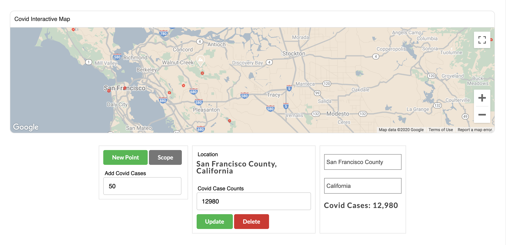
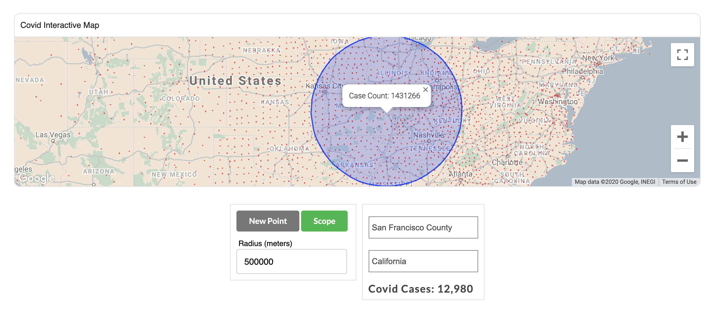

# Covid Interactive Map

> This module features populates confirmed covid cases in each United States county. Users can add, edit or delete covid locations or use the scope feature to see total number of Covid cases in one area.




## Table of Contents

1. [Usage](#Usage)
2. [Requirements](#requirements)
3. [Development](#development)
4. [Server Endpoints](#Server_Endpoints)
5. [Map Setup Explained](#Map_Setup_Explained)

## Usage

> Toggle "Scope" button and click on map to see accumulative covid cases within the radius. Update radius(meters) to expand or minimize scope area.

> Toggle "New Point" button and click on map to add a new covid location. Update "Add Covid Cases" input field to add the number of Covid cases at the new location.

> Click on any red circle Covid location on the map. A component will popup, allowing user to edit or delete Covid case numbers.

> Type in searchbar or select from options drop down to see total number of covid cases at a particular location.


## Requirements

- Node >6.13.0

### Install Dependencies

Within the root directory:

```sh
npm install
```

### Run Service
Within the root directory:

```sh
npm start
npm run build
```


## Development
```sh
Create a .env file in the root directory, with the following properties:

REACT_APP_GOOGLE_API_KEY = INSERT YOUR GOOGLE MAP API KEY
```

## Server Endpoints <a name="Server_Endpoints"></a>

```sh
Work in Progress
```


## Map Setup Explained<a name="Map_Setup_Explained"></a>

This app utilizes Google Maps Javascript API. When the Map.jsx component is loaded, a fetch request is created to collected Covid Case data. Upon completion of the of fetch, the google map api script is loaded. The script includes a callback that will create the map object and runs through subsequent map setups.